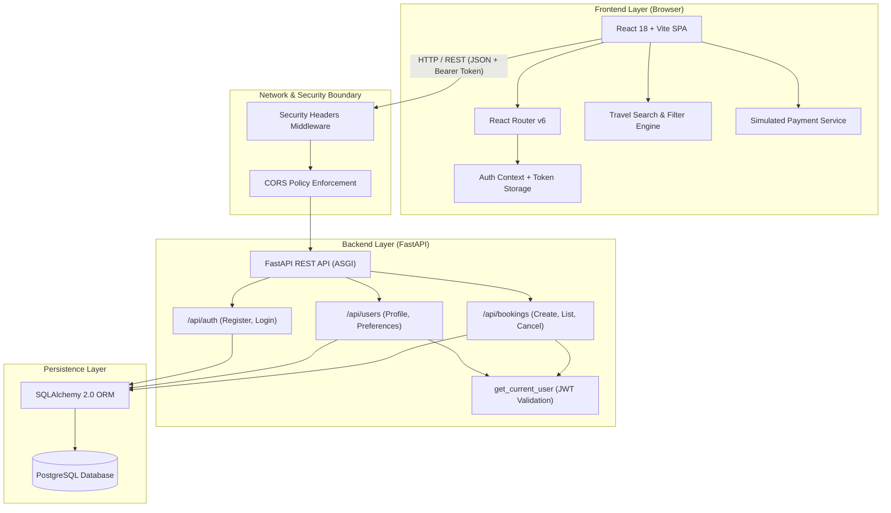
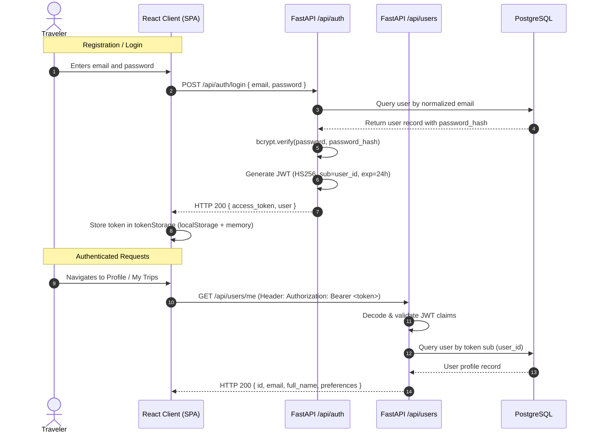
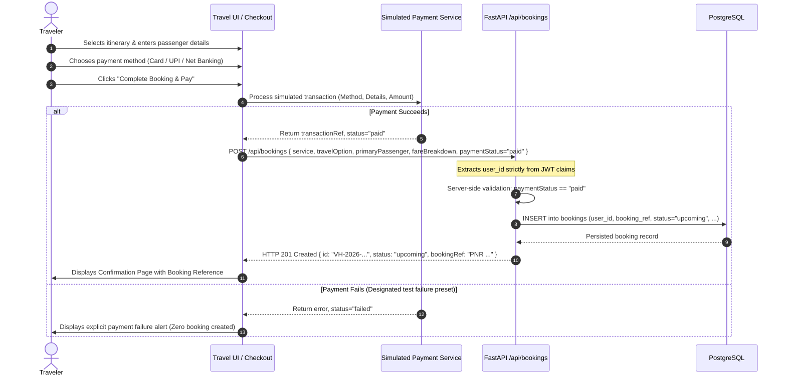
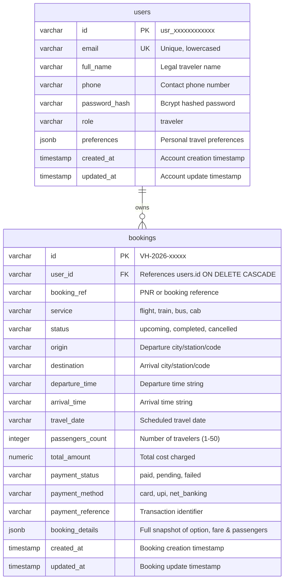

# VoyageHub Architecture Documentation

This document outlines the system architecture, component design, data flow, security model, and database schema for **VoyageHub**, a multi-modal travel booking platform for Flights, Trains, Buses, and Cabs.

---

## 1. High-Level System Architecture

VoyageHub employs a decoupled, client-server architecture consisting of a single-page application (SPA) frontend, an asynchronous REST API backend, and a relational PostgreSQL database.



---

## 2. Frontend Architecture

The frontend is built with React 18, TypeScript, and Vite, styled with Tailwind CSS, and augmented with Lucide React icons and Framer Motion for micro-interactions.

### Key Architectural Components

1. **Routing & Layout (`src/routes/index.tsx`, `src/layouts/RootLayout.tsx`)**:
   - Centralized declarative routes with nested layouts.
   - Dedicated landing pages for `/flights`, `/trains`, `/buses`, and `/cabs`.
   - Unified multi-step booking funnel: `/:service/results` -> `/:service/passengers` -> `/:service/review` -> `/:service/checkout` -> `/:service/confirmation/:bookingId`.
   - Protected route guards (`ProtectedRoute.tsx`) intercepting unauthenticated access to `/bookings` (My Trips), `/bookings/:bookingId`, and `/profile`.

2. **Navigation & Dynamic Island (`src/components/navigation/DynamicIslandNav.tsx`)**:
   - Floating pill navigation pinned to the top viewport center.
   - Default collapsed footprint (~225px) expanding to full navigation width (~747px) upon user interaction.
   - Smooth cubic-bezier timing curve (`cubic-bezier(0.16, 1, 0.3, 1)`): ~650ms expansion, ~600ms collapse, with a 380ms pointer-leave safety buffer.
   - Preserves route navigation state, active tab highlighting, and authentication status.

3. **Authentication Context (`src/context/AuthContext.tsx`)**:
   - Global React context providing `user`, `isAuthenticated`, `login`, `register`, and `logout`.
   - Synchronized with `tokenStorage` in `src/services/api.ts`.
   - Implements resilient token storage with browser `localStorage` and an in-memory fallback for restricted/private browsing modes.

4. **Travel Search & Filtering (`src/services/travel/`)**:
   - Multi-modal local inventory covering key Indian transit routes (Mumbai, Delhi, Bengaluru, Chennai, Hyderabad, Pune, Kolkata, etc.).
   - Fast multi-criteria filter engine (`filterEngine.ts`): price range, duration, stops, departure time slots, operators/airlines, and vehicle classes.
   - Sorting engine (`sortEngine.ts`): price (low/high), duration, departure time, rating.

5. **Location Selector (`src/components/search/LocationSelector.tsx`)**:
   - Context-aware searchable travel selector for airports, railway stations, bus terminals, and city hubs.
   - Full keyboard accessibility (Arrow keys, Enter, Escape) and ARIA attributes (`role="combobox"`, `aria-expanded`).

---

## 3. Backend Architecture

The backend is built with FastAPI, running under Uvicorn as an asynchronous ASGI application.

### Key Architectural Components

1. **Security Headers Middleware (`backend/main.py`)**:
   - Injects defense-in-depth security response headers on all requests:
     - `X-Content-Type-Options: nosniff`
     - `X-Frame-Options: DENY`
     - `X-XSS-Protection: 1; mode=block`
     - `Referrer-Policy: strict-origin-when-cross-origin`

2. **Authentication & Token Handling (`backend/dependencies/auth.py`, `backend/services/auth_service.py`)**:
   - Passwords securely hashed with `bcrypt`.
   - Signed JSON Web Tokens (JWT) using `HS256` containing `sub` (user_id), `email`, and expiration claims.
   - FastAPI `Depends(get_current_user)` extracts and verifies token from the `Authorization: Bearer <token>` header.

3. **Domain Routers (`backend/routers/`)**:
   - `auth.py`: Registration, login, credential verification, JWT issuance.
   - `users.py`: Personal profile retrieval (`/me`), preference updates (`/me/preferences`), password change, account deletion.
   - `bookings.py`: Booking creation (`POST /bookings`), user bookings listing (`GET /bookings`), booking details (`GET /bookings/{id}`), booking cancellation (`PATCH /bookings/{id}/cancel`).

4. **Pydantic Validation Layer (`backend/schemas/`)**:
   - Strict typing using Pydantic v2.
   - `BookingCreate` enforces transport mode `Literal["flight", "train", "bus", "cab"]`, payment method `Literal["card", "upi", "net_banking"]`, payment status `Literal["paid", "pending", "failed"]`, and passenger limits (`1` to `50`).
   - Normalizes email inputs to lowercase and trims whitespace on passenger names.

---

## 4. Authentication & Authorization Sequence



---

## 5. Travel Booking & Payment Flow



---

## 6. Database Schema & Data Integrity

The persistence tier runs on PostgreSQL managed by SQLAlchemy ORM.



### Database Optimization & Indexing
- `users`: Unique index on `email`, primary key on `id`.
- `bookings`:
  - Primary key on `id`.
  - Index on `user_id` (foreign key).
  - Index on `service`.
  - Composite index `ix_bookings_user_id_created_at` on `(user_id, created_at DESC)` for efficient retrieval of user trip history.

---

## 7. Multi-User Isolation & Security Boundaries

1. **Insecure Direct Object Reference (IDOR) Elimination**:
   - `GET /api/bookings/{id}`, `PATCH /api/bookings/{id}/cancel`, and `DELETE /api/bookings/{id}` strictly evaluate:
     ```sql
     SELECT * FROM bookings WHERE id = :booking_id AND user_id = :current_user_id
     ```
   - Attempting to access, cancel, or delete another user's booking record returns `HTTP 404 Not Found`.

2. **SQL Injection Prevention**:
   - 100% of database interactions utilize SQLAlchemy ORM parameterized queries. Zero raw dynamic string interpolation is performed.

3. **Cross-Site Scripting (XSS) Prevention**:
   - React's JSX automatically escapes all dynamic content. Zero instances of `dangerouslySetInnerHTML` exist in the frontend.

4. **Cross-Site Request Forgery (CSRF) Mitigation**:
   - Authentication tokens are transmitted exclusively via the standard `Authorization: Bearer <token>` header, not ambient browser cookies. Browsers do not automatically attach custom Authorization headers across origins, mitigating browser CSRF vectors.

5. **Server-Side Payment Integrity**:
   - The backend validates all payloads before committing to PostgreSQL. Any attempt to forge a confirmed booking with `paymentStatus: "failed"` is rejected with `HTTP 400 Bad Request`.
